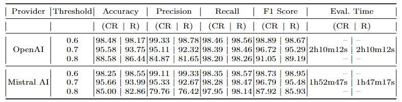
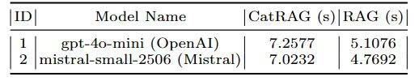
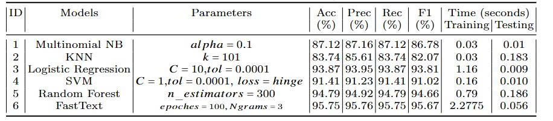

# REBot: From RAG to CatRAG with Semanttic Enrichment and Graph Routing
## Thanh-Ma, Tri-Tam La, Thu-Lam Le Huu, Minh-Nghi Nguyen, Khanh-Van Pham Luu
#### {mtthanh,ncdanh}@ctu.edu.vn, {tamb2203579,thub2206018,nghib2203570,vanb2203592}@student.ctu.edu.vn

## Abstract

Academic regulation advising is vital for helping students interpret and comply with institutional policies, yet building effective systems requires domain-specific regulatory resources. To address this challenge, we propose REBot, an LLM-enhanced advisory chatbot powered by CatRAG, a hybrid retrieval–reasoning framework that integrates RAG with GraphRAG. CatRAG unifies dense retrieval and graph-based reasoning, supported by a hierarchical, category-labeled knowledge graph enriched with semantic features for domain alignment. A lightweight intent classifier routes queries to the appropriate retrieval modules, ensuring both factual accuracy and contextual depth. We construct a regulation-specific dataset and assess REBot on classification and question-answering tasks, achieving state-of-the-art performance with an F1-score of 98.89\%. Finally, we implement a web application that demonstrates the practical value of REBot in real-world academic advising scenarios.

## Architecture

## CatRAG Algorithms

### Algorithm 1: CatRAG-Construct

### Algorithm 2: CatRAG-Query

## Performances

To evaluate the effectiveness of GraphRAG, we conducted a comparative analysis against the standard RAG baseline. The evaluation was performed using a dataset of questions and reference answers derived from our document corpus collected from [Source](https://www.ctu.edu.vn/don-vi-truc-thuoc.html).

The evaluation framework measures the quality of the generated answers based on metrics such as Answer Relevance, Context Recall, and Faithfulness. The detailed results of our experiments are presented below.

### Table 1: Comparison of CatRAG (CR) and RAG (R) across thresholds

### Table 2: Computation Time of CatRAG and RAG (average of 10 runs)

### Table 3: Results of Specialized Domain/Topic Classification

Our findings indicate that the CatRAG system consistently outperforms the standard RAG baseline, particularly on complex questions requiring relational understanding. The structured context from the knowledge graph proves to be a significant factor in improving the quality and accuracy of the generated responses.

## Citation

## Acknowledgement

This study is funded by Can Tho University, Code: THS2025-69
